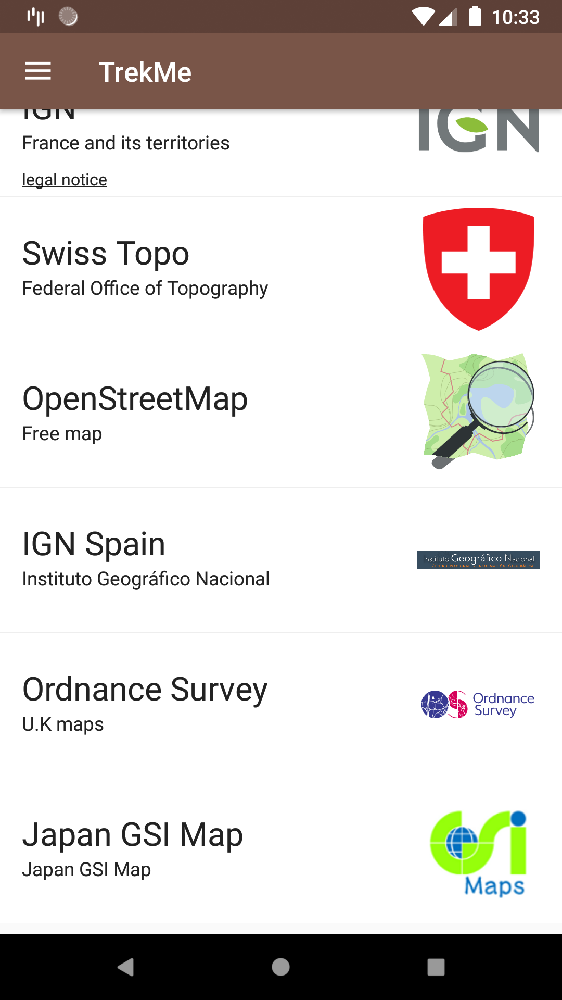

This repository is a clone of https://github.com/peterLaurence/TrekMe
Added support for Japan GSI Map (地理院地図).

  I am very new to github.com; if I am doing bad manners, please let me know. I just want to share my change in case anyone looks for Japan GSI Map support.

Here is <A HREF="https://github.com/kuromimi/TrekMe_JapanGSI/blob/gsi_japan/created_files_for_Japan_GSI_Map.patch">patch file</A> for Japan GSI Support.

